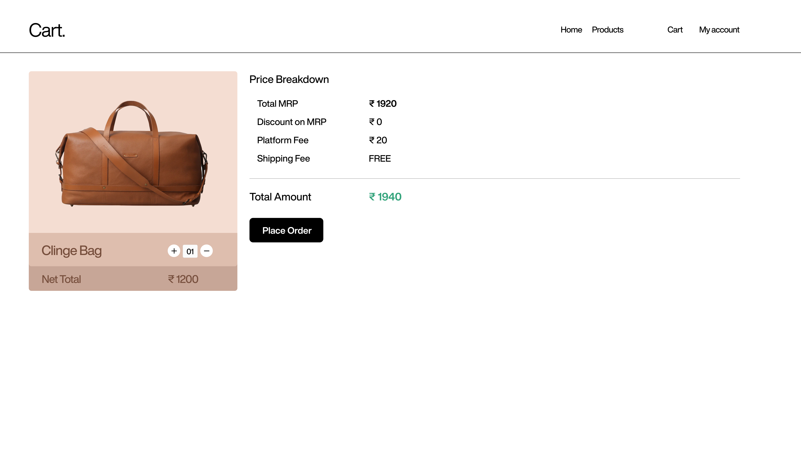

# Modamingle

 AA learning project to deepen my understanding of web development and technologies used in building a modern e-commerce platform for stylish bags. This project is made according to industry standards with proper routes and seperation of concerns.

## Table of Contents

- [Technologies Used](#technologies-used)
- [Features](#features)
- [Environment Variables](#environment-variables)
- [Learning Outcomes](#learning-outcomes)
- [Screenshots](#screenshots)

## Technologies Used

- **Node.js**: A JavaScript runtime for building scalable network applications.
- **Express.js**: A fast, unopinionated, minimalist web framework for Node.js.
- **EJS**: A templating engine that lets you generate HTML markup with plain JavaScript.
- **Tailwind CSS**: A utility-first CSS framework for creating custom designs.
- **MongoDB**: A NoSQL database for storing application data.
- **dotenv**: A zero-dependency module that loads environment variables from a `.env` file.

## Features

- User-friendly interface to explore a wide selection of bags.
- Responsive design optimized for both mobile and desktop views.
- Secure user authentication and session management.
- Easy navigation and robust search functionality.
- Environment variable management for sensitive information.

## Environment Variables

This project utilizes environment variables to securely manage sensitive information such as database connection strings and API keys. You can set up your environment variables by creating a `.env` file in the root directory of the project. 

## Learning Outcomes
-Understanding of MVC Architecture: Learn how to structure a web application using the Model-View-Controller design pattern.
-Use of Templating Engines: Gain experience using EJS for dynamic content rendering.
-Responsive Design: Implement responsive UI using Tailwind CSS for better user experience across devices.
-Environment Management: Learn how to securely manage environment variables using the dotenv package.
-Version Control: Practice using Git and GitHub for version control and collaboration.

## Screenshots

